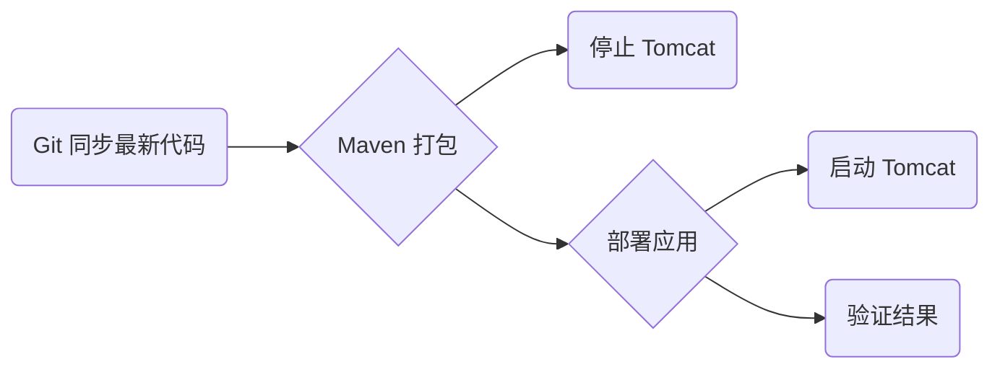

# [用 Jenkins 自动化搭建测试环境](https://www.imooc.com/learn/1008)

## 课程介绍

----

#### 1-1 课程介绍

在大多数互联网企业中, 

搭建测试环境时的困扰,

* 时间紧

* 任务重

* 没人管

  研发laod

自动化测试环境部署带来的幸福感

* 沉痼

课程安排

Jenkins 基础知识

应用服务器

部署项目介绍

Jenknis 自动化部署任务开发

代码修改 & 一键

前置环境准备

* 服务器 OS
* 数据库服务器 
* 已在 Github 上注册了账户
* Java 开发工具 Intellij Idea

## Jenkins 基础

----

#### 2-1 Jenkins 安装


#### 2-2 Jenkins 插件

##### Jenkins 插件安装

* 关于插件

  

* 本课程需要安装的插件

在Jenkins 进入「插件管理」, 

这个插件的作用是用于重新构建, 那么每次输入参数很麻烦, 当我们需要再次构建的时候, 

第二个需要安装的可选插件是 Safe Restart. 这个插件比较方便

这两个插件就是, 单击直接安装, 我们需要等待一段时间, 稍等

#### 2-3 Jenkins 基础设置

##### 配置全局安全性

这种安全配置相对来说不是很安全, 

首先进入「」

在「授权策略」中选择「安全矩阵」, 对 admin 用户赋予管理员权限,  然后「保存」.

##### 添加用户

同样进入「系统管理」, 然后点击「」, 新建用户, 填写相应信息后选择「新建用户」, 创建完这个用户后, 选择「Config Global Security」, 选择刚刚新建的「tester01」, 先全选这些权限, 然后把一开始的 Administrer .

然后用刚刚创建的 tester01 用户来重新登录 Jenkins, 登录后是看不到系统管理的, 说明 tester01 但是不能管理系统. 

##### 本章回顾

* 关于 Jenkins
* Jenkins 安装
* Jenkins 插件
* Jenkins 基础插件

## 应用部署服务器准备

### 3-1 Linux 系统准备

是分别部署在不同服务器上的, 

我们的测试环境将部署在 Linux 操作系统上的, Linux 系统在逗相对较强大, 作为服务器准备, 首先, 你要有一台, 然后

#### 确定 IP 地址

使用 `ifconfig` 查询, 

#### 确定登录用户名、密码

#### 确定可以远程 ssh 连接

ssh 是用于远程, Jenkins , 同样, 我们需要在 Linux 的命令行中

```bash
# netstat -anp|grep :22
```

就说明, 如果没有启动, 需要用命令去启动它

```bash

```

#### 确定防火墙处于关闭状态

```bash
[root@localhost ~]# service iptables stop

[root@localhost ~]# service iptables status
```

就说明服务器处于关闭状态

### 3-2 安装Java环境

在 CentOS 系统中, 

在命令行系统中直接

### 3-3 安装并配置Git


### 3-4 安装并配置Maven


### 3-5 下载Tomcat

选择复制链接, 在需要下载的路径里面, 刚刚复制的下载链接

### 3-6 解压安装Tomcat


### 3-7 配置Tomcat


### 3-8 启动验证Tomcat


### 3-9 新建节点

##### 应用服务部署准备

将 Linux 注册到 Jenkins 上

* **<u>新建节点</u>**

到目前为止, 我们已经准备了 Linux 环境并在上面配置好了Java, Git, Maven, Tomcat, 这一节我们来学习如何把 Linux 服务器注册到 Jenkins 上.

第一步需要新建节点.

回到已经安装好的 Jenkins 控制台页面, 进入「系统管理」->「管理节点」单击「新建节点」(界面左侧「系统管理」下面),输入节点名称「TestEnv」表示这是一个 Test Enviromment, 勾选「Permanent Agent」,单击「OK」. 在描述中输入「这是一台测试环境的 Linux 主机」

### 3-10 配置IP

##### 应用服务部署准备

将 Linux 注册到 Jenkins 上

* 新建节点
* **<u>配置路径、IP、用户名、密码</u>**

在输入完节点基础信息之后,需要配置路径、IP、用户名和密码.

首先需要配置 Jenkins 的「远程工作目录」,因为我们计划使用 root 用户登录这台 Linux 主机,所以我们可以把 Jenkins 的工作目录设置到 `/root/.jenkins`. 启动方法选择「Launch slave agents via SSH」, 在「主机」中输入 Linux 的 IP 地址: 192.168.100.133, 然后在 Credentials 添加用户名和密码, 单击「Add」选择「Jenknins」添加这台 Linux 的 Username 和 Password. 添加完成后从「Credentials」下拉列表中选择刚添加的用户名和密码, 输入完成后保存. 保存成功后可以在「管理节点」界面下看到刚刚新增的节点「TestEnv」

### 3-11 尝试连接

##### 应用服务部署准备

将 Linux 注册到 Jenkins 上

* 新建节点
* 配置路径、IP、用户名、密码
* **<u>启动从节点验证 Linux 服务器已经成功注册到 Jenkins 上</u>**

下面需要启动这个节点, 验证 Linux 服务器已经可以成功连接到 Jenkins 上.

回到 Jenkins 的 Nodes 界面, 单击刚刚添加的节点 TestEnv, 然后单击「Launch agent」, 稍等片刻后可以看到 Jenkins 已经成功连接到节点上, 然后回到 Nodes 列表,可以看到这台 Linux 主机已经成功连接到 Jenkins 上.

### 3-12 运行验证任务

##### 应用服务部署准备

将 Linux 注册到 Jenkins 上

* 新建节点
* 配置路径、IP、用户名、密码
* 启动从节点验证 Linux 服务器已经成功注册到 Jenkins 上
* <u>**新建 Job 验证 Jenkins 任务可以远程运行在 Linux 服务上**</u>

在节点注册成功之后,我们来创建一个简单的任务来验证一下 Jenkins 任务是否可以在这个 Linux 测试环境上运行.

回到 Jenkins 主页, 然后选择「创建一个新任务」,在任务名称中输入「TestTask」作为任务名, 然后选择「构建一个自由风格的软件项目」,然后「OK」,进入任务配置页面后, 首先选中「Restrict where this project can be run」, 然后在「Label Expression」中输入刚刚创建的 Linux 环境的名称「TestEnv」, 这个选项表明我们的任务只允许在 TestEnv 上运行. 

然后在「构建」选项卡下, 在这里我们点击「增加构建步骤」, 选择「Execute shell」, 可以输入一个简单的 shell 命令来验证一下 Jenkins 是否可以远程在这台 Linux 主机上执行命令. 在 Command 中输入`ifconfig`检查一下 IP,然后「保存」.

任务创建完成后,单击「立即构建」,稍等片刻任务执行完毕, 进入新执行的任务(在 Build History下点击#1), 然后选择「Console Output」,这里有控制台输出的日志, 可以看到 Jenkins 远程地在这台 Linux 主机上执行了`ifconfig`命令, 这条命令搜出了 Linux 的 IP 地址, 这个 IP 地址就是这台 Linux 的 IP 地址, 说明这个命令执行是正确的. 

这个简单的任务尝试说明配置是正确的, Jenkins 可以远程在这台 Linux 测试环境上执行相应的命令.

### 3-13 本章回顾

* 准备 Linux 服务器

  这是我们测试应用部署的操作系统

* 为服务器安装 Java, Git, Maven, Tomcat

  这是我们测试应用部署的依赖工具与 Web 应用服务器

* 将服务器注册到 Jenkins 上并验证

  需要将 Linux 测试环境作为远程节点注册到 Jenkins 上并通过一个简单的任务去验证 Jenkins 可以远程在这台 Linux 环境上执行任务, 后面会利用这个远程执行任务的特性让 Jenkins 远程在这台机器上执行构建新测试环境的任务来达到我们最终的目的.

## 部署应用介绍与前期准备

----

#### 4-1 Github的介绍


#### 4-2 部署应用程序


#### 4-3 Github上Fork部署应用程序


#### 4-4 Github上打开fork的部署应用


#### 4-5 复制克隆链接

#### 4-6 将源代码clone到本地

#### 4-7 用Intellij Idea打开克隆好的项目

#### 4-8 简要说明代码源程序

#### 4-9 Maven 构建项目

#### 4-10 创建数据库表

#### 4-11 导入源代码中的sql文件


#### 4-12 执行sql并检查结果


#### 4-13 配置数据库参数


#### 4-14 验证参数是否配置正确


#### 4-15 在git上commit更新代码


#### 4-16 Push更新代码到Github


#### 4-17 部署应用程序的总结—1


#### 4-18 本章回顾


## Jenkins 自动化部署任务开发

----

### 5-1 部署过程介绍

#### Jenkins 自动化部署任务开发

在前面几个章节分别讲解了 Jenkins 准备,部署服务器的准备,还有部署应用的准备. 这一章是我们自动化部署测试环境最关键的一章. 开发自动化部署任务首先

#### 简述自动化部署过程:



1. 需要从 Git 上同步最新的代码, 因为自动化部署程序的源码是放在 Git 服务器上,所以第一步一定要从 Git 上同步最新的代码
2. 通过 Maven 把我们的应用打包,应用本身就是基于 Maven 架构的,所以并不需要额外的配置,只要用通用的 Maven 的命令对这个应用打包就可以.
3. 打包完成后需要执行一个停止 Tomcat 运行的命令, 因为部署应用是要运行在 Tomcat 上的,部署之后需要 Tomcat 停止再启动,所以在部署之前就把 Tomcat 停止.
4. 执行应用程序的部署任务,将最新的应用程序部署到 Tomcat 上
5. 部署完成后启动 Tomcat, 然后访问对应的 Web 页面验证一下我们的应用是否已经成功的启动,更改是否已经生效, 这样就完成了整个应用程序的部署过程.

### 5-2 创建Jenkins 自动化部署任务

在讲解完自动化部署过程之后我们先来看一下自动化部署的代码, 在工程的根目录下有一个叫 `deploy.sh`, 部署代码是写在里面的, 所用的语言是 shell.

```bash
#!/usr/bin/env bash
# 编译+部署order站点

# 需要配置如下参数
# 项目路径, 在 Execute Shell 中配置项目路径, pwd 就可以获取该项目路径
# export PROJ_PATH=这个 jenkins 任务在部署机器上的路径

# 输入你的环境上tomcat的全路径
# export TOMCAT_APP_PATH=tomcat在部署机器上的路径

### base 函数
killTomcat()
{
	pid=`ps -ef|grep tomcat|grep java|awk '{print $2}'`
	echo "tomcat Id list: $pid"
	if [ "$pid" = ""]
	then
	  echo "no tomcat pid alive"
	else
	  kill -9 $pid
	fi
}
cd $PROJ_PATH/order
mvn clean install

# 停 tomcat
killTomcat

# 删除原有工程
rm -rf $TOMCAT_APP_PATH/webapps/ROOT
rm -f $TOMCAT_APP_PATH/webapps/ROOT.war
rm -f $TOMCAT_APP_PATH/webapps/order.war

# 复制新的工程
cp $PROJ_PATH/order/target/order.war $TOMCAT_APP_PATH/webapps/

cd $TOMCAT_APP_PATH/webapps/
mv order.war ROOT.war

# 启动Tomcat
cd $TOMCAT_APP_PATH/
sh bin/startup.sh
```

`#!/usr/bin/env bash` 是bin shell 的一个标准写法, 意思是需要调用 Linux 内核下的 bash shell 库.

下面有两个说明,我们在执行这段代码之前需要 export 两个参数, 一个参数是 PROJ_PATH, 就是这个 Jenkins 任务在目标机上的任务路径,第二个需要 export 的参数是 TOMCAT_APP_PATH,就是 tomcat 在目标机上的全路径

这里有个函数叫 `killTomcat`, 因为我们的构建过程中有一步是需要停掉 Tomcat 的, 所以我们把停止 Tomcat 的任务抽象成一个方法函数,每次需要停 Tomcat 的时候, 去调用这个 `killTomcat`函数就可以了.

`cd $PROJ_PATH/order` 这句话的意思当前的执行语句需要进入 order 工程的根目录,然后执行`mvn clean install`, 就是利用 maven 的构建功能去构建这个工程,在工程构建好了之后,我们需要调用 `killTomcat` 这个函数去停止 Tomcat 的运行. Tomcat 停止之后需要对原有 Tomcat 上的工程进行一下清理,也就是执行删除原有部署应用的动作, 首先需要把 Tomcat 下 `/webapps/ROOT`目录删除,原有的工程是部署在这个路径下.第二个是需要删除`/webapps/ROOT.war`这个文件. 删除文件运行的命令是`rm -f`,删除目录运行的命令是`rm -rf`, 第三个需要删除的文件是 `/webapps/order.war`.通过这三步动作我们可以把 tomcat 上原有的工程文件删除干净.

下面一步是把构建好的新的工程部署到 tomecat, 部署的方法是把`$PROJ_PATH`下通过 Maven 构建好的新的 `order.war`复制到 `$TOMCAT_APP_PATH/webapps/`. 这个动作完成之后, 需要 `cd` 到`$TOMCAT_APP_PATH/webapps/`, 然后需要将刚刚复制过去的`order.war`文件重命名成 `ROOT.war`, 这个的意思是说我们需要把构建好的工程作为一个 root 工程部署在 tomcat 上,这个 root 工程的意思是当它运行起来之后它是运行在 tomcat 的根目录上, 还需注意Linux 上重命名一个文件的命令是`mv`, 重命名好之后我们所有的准备工作就做好了,然后需要启动 Tomcat,同样我们需要当前的路径 `cd` 到 tomcat 的根目录上,之后运行`sh bin/startup.sh`就可以了.

#### 创建Jenkins部署任务

1. 创建 Jenkins 任务
2. 填写 server 信息
3. 配置 git 参数
4. 填写构建语句,实际部署测试环境

来到 Jenknis 根目录下, 按照这个过程首先新建一个 Jenkins 任务,这个任务起名为 DeployOrder, 选择「构建一个自由风格的软件项目」单击「OK」, 首先在描述对话框里简单描述一下: 这个任务负责部署 Order 工程到 Tomcat 中, 并启动 Tomcat.填写完 Server 信息之后需要选择 Jenkins 任务运行的 Server 位置(即在「Restrict where this project can be run」-> 「Label Expression」中填写`TestEnv`).

填完 Linux 测试环境之后, 我们需要填写源码信息(在「源码管理」下), 即 Git 库的位置. 把 order 工程在 Github 上的 SSH 地址贴到「Repository URL」,然后选择下面的「Add Repository」.然后再下面的「Additional Behaviours」中选择 「Checkout to a sub-directory」, 因为这个工程的名字叫 order, 所以把「Local subdirectory for repo」也填成 order.也就是说我们的源代码会从 Git 库上下载到当前路径下的一个子目录,子目录的名字叫 order.

输入完成 Git 信息后来到「构建」->「增加构建步骤」->「Execute shell」, 添加一下构建的 shell 命令.

```shell
BUILD_ID=DONOTKILLME
. /etc/profile
# 配置运行参数
export PROJ_PATH=`pwd`
export TOMCAT_APP_PATH=/root/apache-tomcat-9.0.8

sh $PROJ_PATH/order/deploy.sh
```

[第1行] 这句话的意思指的是当 Jenkins 部署完 Server 任务之后 Server 线程不要被杀掉. 如果你不加这句话, 当Jenkins 执行完任务之后, Jenkins 的进程会被自动杀掉,那就是启动之后 Server 的进程也会被杀掉.所以当你加完这句话之后,Jenkins 执行完之后 Jenkins 进程会自动关闭, 但 server 的进程不会跟着被关闭.那就是 Server 一直处着活着的状态, 那也就是能达到我们部署完之后启动 Server 并且让 Server 一直运行的效果.

[第2行] 这句话是加载一些配置参数,因为很多配置参数是放在`/etc/profile`,所以需要在运行 Jenkins 任务时依赖性质的把`/etc/profile`里边的配置文件加载到 Jenkins 任务里.

[第4、5行] 就是上面那个 sh 文件中提到的需要配置的两个参数.

[第6行] 运行部署脚本

添好整个的构建脚本后, Jenkins 的任务就填写完毕,单击「保存」

### 5-3 运行部署任务

下面我们需要运行一下这个 Jenkins 任务

1. 执行 Jenkins 部署任务
2. 确定执行结果成功
3. 打开浏览器访问部署应用程序
4. 确定发布结果的正确性

我们来执行一下这个 Jenkins 的构建任务, 单击「立即构建」,稍等片刻可以看到在 Build History 里新建了一个构建任务, 经过一段时间的等待这个 Jenkins 任务执行成功了.打开浏览器访问一下对应 sever 的主页(打开 192.168.100.133:8090), 在页面上可以正常看到对应的部署的测试环境上应用的主页, 说明我们的测试应用已经部署成功了.

### 5-4 本章回顾

简单回顾下本章所介绍的内容:

* 典型的自动化部署任务过程
* Jenkins 自动化部署任务开发中的一些要素
* 实际执行自动化部署程序

本章讲解了典型自动化部署任务执行过程并且实际创建了一个 Jenkins 自动化部署任务, 然后对其中的一些要素进行讲解,最后实际执行了 Jenkins 自动化部署任务.通过这个任务我们可以看到测试环境被自动化构建出来了.有了这个任务,接下来就可以尝试实战环节.在实战中我们实际体验一下如何达到开发修改代码然后测试一键部署测试环境.

## 实战

----

### 6-1 实战


## 总结

----

### 7-1 课程总结